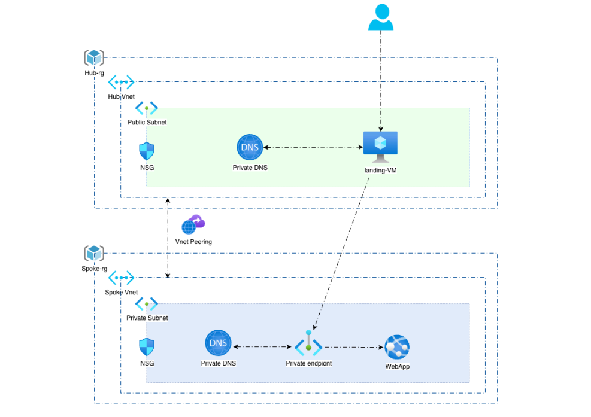

# Manage Azure basic Network components

## _#week_twentysix - Azure Networking over Terraform & GitHub Action_
 

_**duration: 1 week**_
  

ForgTech company wanna test your ability to deliver their requirements into their azure
subscription.
This will help you build a good reputation. The purpose of this task is to protect and manage
their network traffic to/from Vnets, by securing azure webapp traffic to accessed only internaly,
the diagram below clear the network flow:

  

The FrogTech Tech Lead Team requests to protect the azure network resource with the
following requirements:

1. Deploy and build all components presented in the diagram.
2. The webapp set as private, not publicly accessable.
3. the webapp attached NSG accept traffic from its private endpoint for port 80.
4. Both private DNS map Private endpoint IP.
5. The Spoke Vnet subnet set as private.
6. Create a VM into a public subnet.
7. The attached NSG to subnet/vm accept 22 port from your device IP only.
8. setup Vnet peering between both Vnets.
 

 

### **References:**

- https://github.com/Mohamed-Eleraki/terraform/tree/main/Azure/06-Azure-networking
