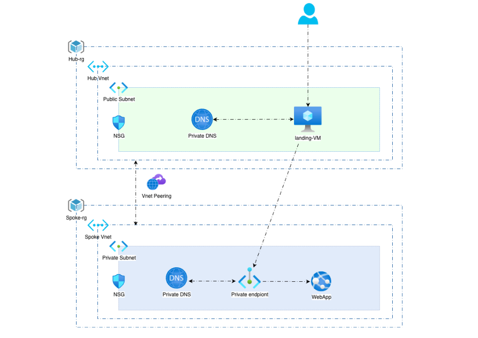

# Manage Azure basic Network components

## _#week_twentysix - Azure Networking over Terraform & GitHub Action_
 

_**duration: 1 week**_
  

ForgTech company wanna test your ability to deliver their requirements into their Azure
subscription.
This will help you build a good reputation. The purpose of this task is to protect and manage
their network traffic to/from VNets by securing Azure Web App traffic to be accessed only internally,
The diagram below clarifies the network flow:

  

The FrogTech Tech Lead Team requests to protect the Azure network resource with the
following requirements:

1. Deploy and build all components presented in the diagram.
2. The web app is set as private, not publicly accessible.
3. The web app-attached NSG accepts traffic from its private endpoint on port 80.
4. Both private DNS map Private endpoint IP.
5. The Spoke VNet subnet is set as private.
6. Create a VM in a public subnet.
7. The attached NSG to subnet/vm accept 22 port from your device IP only.
8. Set up VNet peering between both VNets.
 

 

### **References:**

- https://github.com/Mohamed-Eleraki/terraform/tree/main/Azure/06-Azure-networking
